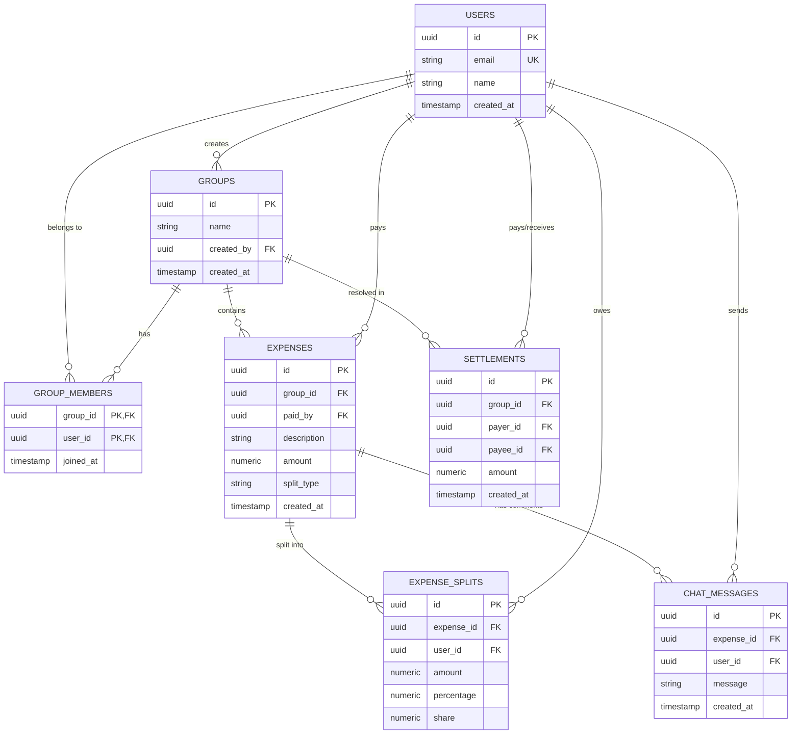

# Project Context: Splitwise Clone (MVP)

This document is the absolute source of truth for the Splitwise Clone project. It outlines the product requirements, system design, tech stack, database schema, API design, deployment plan, and implementation logs.

---

## 1. Product Understanding & Scope

### Goal
Build and deploy a simplified, responsive Splitwise-inspired web application in under 24 hours. The application will allow users to register, log in, create groups, invite/manage group members, record expenses with various splitting methods, discuss expenses in real-time, and view/settle balances.

### User Personas
* **Roommates**: Split rent, utilities, and grocery bills.
* **Travelers/Friends**: Track group expenses during trips and settle up at the end.

### Core Workflows
1. **Authentication**: Sign Up, Sign In, and Sign Out.
2. **Group Management**:
   * Create a group.
   * View all groups the user is a member of.
   * Invite/add existing registered users to a group by email.
   * Remove members from a group (only if they have a net balance of zero).
3. **Expense Management**:
   * Add an expense to a group.
   * Split expenses in four ways:
     * **Equally**: Split evenly among all or selected members.
     * **Unequally**: Explicit amounts specified for each member (must sum to the total).
     * **By Percentage**: Percentage specified for each member (must sum to 100%).
     * **By Share**: Shares specified for each member (split proportionally to shares).
   * Delete an expense (reverts the balances).
4. **Expense Chat**:
   * Real-time text chat inside each expense detail view to discuss discrepancies.
5. **Balances & Settlements**:
   * View group-wise individual balances (who owes what).
   * Record a settlement payment (User A pays User B a specific amount) to clear outstanding debt.

### Out-of-Scope Features (For Time Constraints)
* Multi-currency support (Defaulting to one currency, e.g., USD or INR).
* Receipt image upload and OCR scanning.
* Recurring expenses.
* Detailed activity feed/notifications (beyond the expense chat).
* Debt simplification across multiple groups (simplification will be group-specific).

---

## 2. Technical Stack & Architecture

We propose a modern, serverless-friendly, and rapid-development tech stack to ensure delivery before 12:00 AM.

* **Frontend Framework**: Next.js 14 (React) with App Router.
* **Styling**: Tailwind CSS v3 (for rapid, responsive UI construction).
* **Database**: PostgreSQL (relational database requirement) hosted on **Supabase**.
* **Authentication**: Supabase Auth (JWT-based email/password sign-in).
* **Real-time Engine**: Supabase Realtime (for real-time chat messages inside expenses without needing a custom WebSocket server).
* **Backend Logic**: Next.js Server Actions or API Routes for database queries, transaction management, and balance calculations.
* **Hosting**: Vercel (Frontend & Serverless Backend) + Supabase (Database & Real-time).

---

## 3. Database Schema

### Table Definitions

1. **`users`**
   * `id`: `uuid` (Primary Key, references Supabase auth.users)
   * `email`: `text` (Unique)
   * `name`: `text`
   * `created_at`: `timestamp with time zone`

2. **`groups`**
   * `id`: `uuid` (Primary Key)
   * `name`: `text`
   * `created_by`: `uuid` (References `users.id`)
   * `created_at`: `timestamp with time zone`

3. **`group_members`**
   * `group_id`: `uuid` (Composite Primary Key, References `groups.id` ON DELETE CASCADE)
   * `user_id`: `uuid` (Composite Primary Key, References `users.id` ON DELETE CASCADE)
   * `joined_at`: `timestamp with time zone`

4. **`expenses`**
   * `id`: `uuid` (Primary Key)
   * `group_id`: `uuid` (References `groups.id` ON DELETE CASCADE)
   * `paid_by`: `uuid` (References `users.id` ON DELETE SET NULL)
   * `description`: `text`
   * `amount`: `numeric(12, 2)`
   * `split_type`: `text` (Values: `'equal'`, `'unequal'`, `'percentage'`, `'share'`)
   * `created_at`: `timestamp with time zone`

5. **`expense_splits`**
   * `id`: `uuid` (Primary Key)
   * `expense_id`: `uuid` (References `expenses.id` ON DELETE CASCADE)
   * `user_id`: `uuid` (References `users.id` ON DELETE CASCADE)
   * `amount`: `numeric(12, 2)` (The actual calculated debt amount)
   * `percentage`: `numeric(5, 2)` (Nullable, for percentage splits)
   * `share`: `numeric(10, 2)` (Nullable, for share splits)

6. **`settlements`**
   * `id`: `uuid` (Primary Key)
   * `group_id`: `uuid` (References `groups.id` ON DELETE CASCADE)
   * `payer_id`: `uuid` (References `users.id` ON DELETE SET NULL)
   * `payee_id`: `uuid` (References `users.id` ON DELETE SET NULL)
   * `amount`: `numeric(12, 2)`
   * `created_at`: `timestamp with time zone`

7. **`chat_messages`**
   * `id`: `uuid` (Primary Key)
   * `expense_id`: `uuid` (References `expenses.id` ON DELETE CASCADE)
   * `user_id`: `uuid` (References `users.id` ON DELETE CASCADE)
   * `message`: `text`
   * `created_at`: `timestamp with time zone`

---

## 4. Engineering & Core Logic Details

### Balance Calculations
The balance for any user in a specific group is calculated by aggregating their transactions:
1. **Owed to user** (from expenses they paid): Sum of `amount` in `expenses` where `paid_by = user_id`.
2. **Owed by user** (from expense splits): Sum of `amount` in `expense_splits` where `user_id = user_id`.
3. **Sent by user in settlements**: Sum of `amount` in `settlements` where `payer_id = user_id`.
4. **Received by user in settlements**: Sum of `amount` in `settlements` where `payee_id = user_id`.

**Net Balance formula**:
$$\text{Net Balance} = (\text{Total Paid Expenses} + \text{Total Sent Settlements}) - (\text{Total Owed Splits} + \text{Total Received Settlements})$$

* A **positive** net balance means the group owes the user money.
* A **negative** net balance means the user owes the group money.

### Debt Simplification Algorithm (Group Level)
To show a simplified list of "who owes how much to whom" within a group:
1. Fetch the Net Balance for every member of the group.
2. Filter members into two lists:
   * **Debtors**: Users with `balance < 0` (sorted ascending, most negative first).
   * **Creditors**: Users with `balance > 0` (sorted descending, most positive first).
3. Greedily match the largest debtor with the largest creditor:
   * Let $D$ be the debtor and $C$ be the creditor.
   * Settlement amount $S = \min(|D.\text{balance}|, C.\text{balance})$.
   * Create a simplified transaction: "$D$ owes $C$ amount $S$".
   * Update balances: $D.\text{balance} \mathrel{+}= S$ and $C.\text{balance} \mathrel{-}= S$.
   * Remove settled users (balance near 0) and repeat until all balances are resolved.
This logic runs dynamically on the frontend/backend and does not need to be persisted directly, keeping the database simple.

---

## 5. UI/UX Page Routing & Screens

We will build a clean, responsive Dashboard layout:
1. **`/login` / `/signup`**: Simple, modern card interfaces for user registration and sign-in.
2. **`/` (Dashboard)**:
   * Sidebar with navigation, list of user's groups, and user profile/logout.
   * Main Panel showing overall summary: Total Outstanding Balance (Owed/Owes) and a list of all groups with current net balances.
   * "Create Group" Modal/Form.
3. **`/groups/[id]` (Group Details)**:
   * Group header with group name and "Invite Member" button.
   * List of members and their simplified debts/balances.
   * "Add Expense" button opening a modal.
   * Expense ledger (chronological list of expenses and settlements). Clicking an expense opens its detail panel.
   * "Settle Up" button opening a quick settlement modal.
4. **`/groups/[id]/expenses/[expenseId]` (Expense Detail + Chat)**:
   * Detailed breakdown of how the expense was split.
   * Delete expense button.
   * Live chat sidebar/section using Supabase Realtime to send and receive messages instantly.

---

## 6. Implementation & Deployment Plan

### Phase 1: Setup & Initialization
* Initialize Next.js 14 project.
* Set up Supabase Client and Database schema.
* Implement global CSS theme and layout variables.

### Phase 2: Core Backend Actions & Auth
* Set up Auth state listener.
* Write database triggers/procedures or server actions for CRUD operations on groups, expenses, splits, and settlements.
* Implement the group-level balance calculations and the greedy settlement algorithm.

### Phase 3: UI Construction (Next.js Pages)
* Build Login/Register screens.
* Build Dashboard and Group views.
* Add split calculation helpers and validation checks in the "Add Expense" forms.

### Phase 4: Chat Integration & Real-time
* Implement Supabase Realtime subscription on `chat_messages` for the open expense detail view.

### Phase 5: Deployment & Polish
* Deploy to Vercel.
* Run end-to-end user flows.

---

## 7. Change Log & History

* **2026-06-14 16:50**: Added Group Deletion feature. Deleting a group cascades to remove all members, expenses, settlements, splits, and comments in the database. Added safety rule in `deleteGroup` to block deletion unless the group is fully settled up (all net balances are $0.00). Conditionally rendered the "Delete Group" button in the group header.
* **2026-06-14 16:30**: Fixed profile fetch crash where `.single()` failed if the DB trigger had not committed/run. Switched to `maybeSingle()` and added client-side auto-creation fallback to ensure `public.users` sync is flawless.
* **2026-06-14 15:15**: Confirmed technical stack choices: Tailwind CSS v3, Supabase (PostgreSQL + Auth + Realtime), Greedy Debt Simplification, and Cloud Supabase environment for immediate deployment. Updated `AI_CONTEXT.md` accordingly.
* **2026-06-14 15:10**: Initialized proposed specification for MVP based on fast-delivery constraints.

---

## 8. AI Prompts & Interaction History

### Round 1 Q&A (Determining MVP Scope and Tech Stack)
**AI Questions**:
1. Styling framework choice: Vanilla vs Tailwind?
2. Supabase choice for Auth + DB + Realtime chat?
3. Greedy Debt Simplification logic choice?
4. Direct Cloud Supabase project environment?

**User Answers**:
1. Tailwind CSS
2. Yes (Supabase)
3. Yes (Dynamic Greedy Debt Simplification)
4. Yes (Cloud Supabase development)
